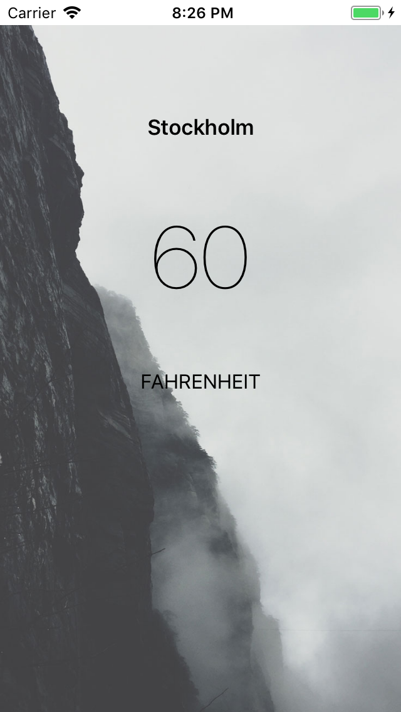

# WeatherApp_RESTAPI_JSON
Here is really nice example of Weather app which was created with REST API and JSON. Enjoy!

<h3>Please don't forgot to use your API token in "forecastAPIKey",my will be not a available for you because i'm already regenerate that one.</h3>
 
For API request was used https://darksky.net/

  

